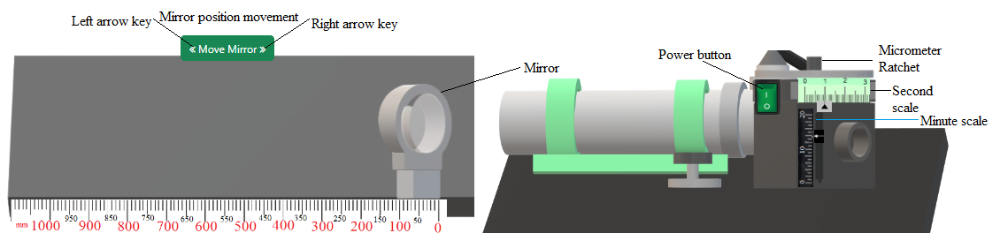

## Procedure

<!-- 

  
Figure 1. Gear tooth vernier caliper with spur gear          

 -->

1.	Prior to measuring ensure surface must be cleaned.
2.	Mount the autocollimator in such a way that its axis should be parallel to the test surface.
3.	Mark distances on the test surface parallel to the collimator axis based on the length of the test block.
4.	Begin numbering the marked points starting from ‘0’.
5.	Place the test block on the testing surface, aligning it with the ‘0-1’ marks, and ensure test surface is normal  to the collimator axis.
6.	Adjust the collimator until the cross wire and its mirrored image converge when observed through eyepiece.
7.	Move the test block to another position, ‘1-2’, on the test surface while maintaining its reflecting surface perpendicular to the direction of movement.
8.	Any non-coincidence between the cross wire and the image confirms unevenness in the test surface. The scale in the collimator provides the direct measure of the angle of deviation 
9.	Repeat the procedure along the entire length of the test surface and note down the readings.
10.	 Calculate the deviation from straightness  at each point relative to the initial point and plot these values to detect any deviations or errors in straightness.

